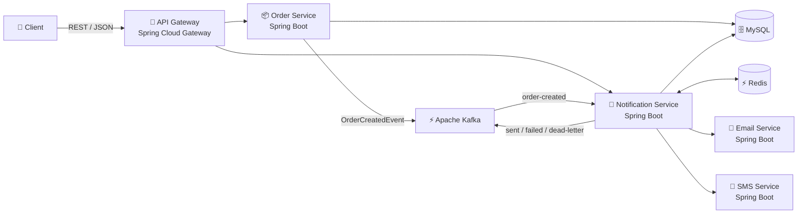

# Etch

Etch is a small notification hub built on Kafka. You place an order, the order service answers right away, and the emails and texts go out in the background through their own services.


## Why I built it

I wanted to understand what happens when the slow, unreliable part of a system sits behind a message queue. Sending a notification is a good example. Email and SMS providers time out, go down, and occasionally reject a message outright, and none of that should make an order fail or make a customer wait.

So I built the whole path to see how it holds up: an order comes in, an event goes onto Kafka, and a separate service picks it up and handles delivery. The parts I cared about most were the unglamorous ones. What happens when a send fails? How many times do you retry? Where does a message go when it can never succeed? And what stops a customer from getting the same email twice when Kafka redelivers an event? Etch is my answer to those questions, kept small enough to read in an afternoon.

## How it fits together



1. The client creates an order through the gateway.
2. The order service saves it to MySQL, publishes an `order-created` event, and responds immediately.
3. The notification service consumes the event and creates one notification per requested channel (email, SMS, or both).
4. Each notification is sent through the email or SMS service. If a send fails temporarily, it's retried with exponential backoff.
5. If it fails for good, or runs out of retries, it goes to a dead-letter topic instead of being dropped.

## What it does

- **Async by design.** Creating an order never waits on delivery.
- **Retries and a dead-letter queue.** Temporary failures are retried with backoff. Permanent failures and exhausted retries land in the `notification-dlt` topic and get logged.
- **No duplicates.** Redis tracks which events and notifications have already been handled, so a redelivered Kafka message doesn't send twice.
- **Five services, each in its own container.** Gateway, order, notification, email, and SMS. The email and SMS services are mocks that fail on purpose, so you can watch the failure handling work.
- **Tested.** Unit tests for the logic, plus Testcontainers integration tests that run against real MySQL, Kafka, and Redis.
- **Ships to AWS.** A GitHub Actions pipeline tests the code, builds the Docker images, and deploys to ECS Fargate.

## Tech stack

Java 25, Spring Boot, Spring Cloud Gateway, Apache Kafka, MySQL, Redis, JUnit and Testcontainers, Docker and Docker Compose, GitHub Actions, and AWS (ECS/Fargate, ECR, RDS, ElastiCache).

## Running it

You need Docker with Compose v2. To build or test outside Docker you also need JDK 25 and Maven 3.9 or newer.

From the repo root:

```bash
docker compose up -d --build
```

That starts Kafka, MySQL, Redis, and all five services. The first build takes a few minutes.

| Service | URL |
|---|---|
| API Gateway | http://localhost:8080 |
| Order Service | http://localhost:8081 |
| Notification Service | http://localhost:8082 |
| Email Service (mock) | http://localhost:8083 |
| SMS Service (mock) | http://localhost:8084 |

### Try it

Create an order through the gateway. Three demo users are created on startup.

```bash
curl -s -X POST http://localhost:8080/orders \
  -H 'Content-Type: application/json' \
  -d '{"userId":1,"orderNumber":"ORD-1001","total":49.99,"channels":["EMAIL","SMS"]}'
```

Then look at what happened to its notifications:

```bash
curl -s http://localhost:8080/notifications/order/1
```

The mock services reject some requests on purpose, so create a few orders and watch the notification service work through retries and dead-lettering:

```bash
docker compose logs -f notification-service
```

### Stopping it

```bash
docker compose down
```

Add `-v` to also wipe the MySQL volume and start clean next time.

## Configuration

Everything has a sensible local default, and `docker-compose.yml` overrides what needs to change inside containers. These are the ones you're most likely to touch:

| Variable | Used by | Default | What it does |
|---|---|---|---|
| `ORDER_SERVICE_URL`, `NOTIFICATION_SERVICE_URL` | api-gateway | `http://localhost:8081`, `http://localhost:8082` | Where the gateway forwards requests |
| `KAFKA_BOOTSTRAP_SERVERS` | order-service, notification-service | `localhost:9092` | Kafka brokers |
| `DB_HOST`, `DB_PORT`, `DB_NAME`, `DB_USERNAME`, `DB_PASSWORD` | order-service, notification-service | `localhost`, `3306`, one schema per service, `etch`, `etch` | MySQL connection |
| `REDIS_HOST`, `REDIS_PORT` | notification-service | `localhost`, `6379` | Redis, used for deduplication |
| `EMAIL_SERVICE_URL`, `SMS_SERVICE_URL` | notification-service | `http://localhost:8083`, `http://localhost:8084` | Where deliveries are sent |
| `EMAIL_FAILURE_RATE`, `SMS_FAILURE_RATE` | email-service, sms-service | `0.05` | Share of requests the mock rejects permanently |
| `EMAIL_UNAVAILABLE_RATE`, `SMS_UNAVAILABLE_RATE` | email-service, sms-service | `0.0` | Share of requests the mock answers with a 503, which gets retried |

## Testing

```bash
mvn test      # unit tests
mvn verify    # unit tests plus the Testcontainers integration tests (needs Docker)
```

To test one service along with the shared modules it depends on:

```bash
mvn -pl services/order-service -am test
```

## Project layout

```text
services/
├── api-gateway/
├── order-service/
├── notification-service/
├── email-service/
└── sms-service/

shared/
├── common-events/    event classes shared between services
├── common-dto/       request and response types
└── common-utils/     exceptions and logging helpers

infrastructure/
├── docker/           MySQL init script
└── aws/              ECS task definitions and setup notes

.github/workflows/    CI/CD pipeline
```

## Deployment

The repo includes ECS task definitions for each service, targeting ECS Fargate with images in ECR, MySQL on RDS, and Redis on ElastiCache. The GitHub Actions pipeline runs the tests, builds the images, and pushes and deploys them when AWS credentials and repository secrets are configured. See [infrastructure/aws/README.md](infrastructure/aws/README.md) for the setup notes.
