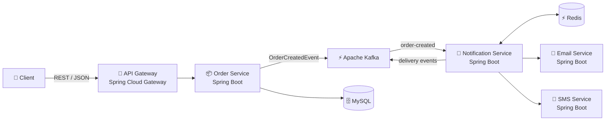

# Etch

Etch is a distributed notification hub using Apache Kafka to decouple high-volume business orders from notification delivery pipelines.


## System architecture



## Tech stack

### Core stack
- **Backend:** Java 21, Spring Boot, Spring Cloud Gateway
- **Messaging:** Apache Kafka
- **Database:** MySQL, Flyway
- **Caching & Idempotency:** Redis
- **API:** REST, JSON, Swagger/OpenAPI
- **Security:** JWT authentication

### Engineering and testing
- **Testing:** JUnit, Spring Boot Test, Testcontainers
- **Observability:** Spring Boot Actuator, Prometheus, Grafana, structured logging
- **DevOps:** Docker, Docker Compose, GitHub Actions
- **Deployment:** AWS ECS/Fargate, Amazon ECR, Amazon RDS, ElastiCache

## Key features

- asynchronous, event-driven notification processing with Kafka
- independent email and SMS delivery services
- configurable retry handling and dead-letter queue
- Redis-backed deduplication and idempotency
- JWT-protected API gateway
- structured logging with correlation IDs across services
- persistent notification history and audit trail
- Swagger/OpenAPI documentation for each service
- unit and Testcontainers-based integration tests
- Prometheus metrics and Grafana dashboards

## Prerequisites

- Docker with Docker Compose v2, to run the full stack
- JDK 21 and Maven 3.9 or newer, to build and test outside Docker

## Running locally

Requires Docker. From the repo root:

```bash
docker compose up -d --build
```

This starts Kafka (KRaft, single node), MySQL, Redis, Prometheus, Grafana, and all five services. The first build takes a few minutes; subsequent starts are faster.

| Service | URL |
|---|---|
| API Gateway | http://localhost:8080 |
| Order Service | http://localhost:8081 |
| Notification Service | http://localhost:8082 |
| Email Service (mock) | http://localhost:8083 |
| SMS Service (mock) | http://localhost:8084 |
| Grafana | http://localhost:3000 |
| Prometheus | http://localhost:9090 |

Each service exposes Swagger UI at `/swagger-ui.html` and its OpenAPI document at `/v3/api-docs`.

### Try it end to end

Get a token:

```bash
TOKEN=$(curl -s -X POST http://localhost:8080/auth/token \
  -H 'Content-Type: application/json' \
  -d '{"username":"demo"}' | jq -r .accessToken)
```

Create an order:

```bash
curl -s -X POST http://localhost:8080/orders \
  -H "Authorization: Bearer $TOKEN" \
  -H 'Content-Type: application/json' \
  -d '{"userId":1,"orderNumber":"ORD-1001","total":49.99,"channels":["EMAIL"]}' | jq
```

Demo users are seeded by Flyway. After creating an order, inspect its notification status and audit history:

```bash
AUTH=(-H "Authorization: Bearer $TOKEN")

curl -s "${AUTH[@]}" http://localhost:8080/notifications/order/1 | jq
curl -s "${AUTH[@]}" "http://localhost:8080/notifications/1/history" | jq
curl -s "${AUTH[@]}" "http://localhost:8080/admin/dlt" | jq
```

The mock email and SMS services intentionally fail a configurable percentage of requests, making retries and dead-letter handling easy to observe locally.

## Testing

Run unit tests:

```bash
mvn test
```

Run unit and Testcontainers integration tests:

```bash
mvn verify
```

The integration suite requires Docker.

## Project structure

```text
services/
├── api-gateway/
├── order-service/
├── notification-service/
├── email-service/
└── sms-service/

shared/
├── common-events/
├── common-dto/
├── common-security/
└── common-utils/

infrastructure/
├── docker/
└── aws/

.github/
└── workflows/
```

## Deployment

The repository includes AWS ECS deployment configuration for:

- ECS Fargate
- Amazon ECR
- Amazon RDS for MySQL
- ElastiCache for Redis
- CloudWatch Logs

The GitHub Actions pipeline builds and tests the services, builds Docker images, and contains the configuration required to publish and deploy them when the appropriate AWS credentials and repository secrets are provided.

## Design highlights

### Asynchronous processing

Creating an order does not wait for notification delivery. The Order Service persists the order and publishes an event to Kafka, allowing notification processing to happen independently.

### Failure handling

Transient delivery failures are retried. Messages that exhaust their retry attempts are moved to a dead-letter topic where they can be inspected separately.

### Idempotency

Redis is used to prevent the same notification from being processed or delivered multiple times.

### Observability

Requests and events carry correlation IDs across services. Spring Boot Actuator exposes application health and metrics, which are collected by Prometheus and visualized through Grafana.
