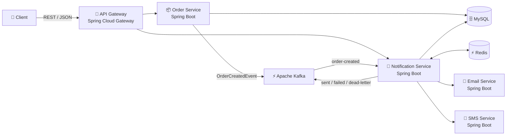

# Etch

Etch is a distributed notification hub using Apache Kafka to decouple high-volume business orders from email and SMS delivery.


## System architecture



## Tech stack

- **Backend:** Java 21, Spring Boot, Spring Cloud Gateway
- **Messaging:** Apache Kafka
- **Database:** MySQL, Flyway
- **Caching and idempotency:** Redis
- **Testing:** JUnit, Spring Boot Test, Testcontainers
- **DevOps:** Docker, Docker Compose, GitHub Actions
- **Deployment:** AWS ECS/Fargate, Amazon ECR, Amazon RDS, ElastiCache

## Key features

- five Spring Boot services that process orders and deliver email and SMS notifications asynchronously over Kafka
- retry handling with exponential backoff, and a dead-letter topic for notifications that fail permanently
- Redis-backed deduplication, so a redelivered Kafka event is never processed or sent twice
- persisted notification status per order and channel
- unit and Testcontainers-based integration tests
- Dockerfiles for every service, a Docker Compose stack, and a GitHub Actions pipeline that tests, builds, and deploys to AWS ECS

## Prerequisites

- Docker with Docker Compose v2, to run the full stack
- JDK 21 and Maven 3.9 or newer, to build and test outside Docker

## Running locally

From the repo root:

```bash
docker compose up -d --build
```

This starts Kafka (KRaft, single node), MySQL, Redis, and all five services. The first build takes a few minutes; subsequent starts are faster.

| Service | URL |
|---|---|
| API Gateway | http://localhost:8080 |
| Order Service | http://localhost:8081 |
| Notification Service | http://localhost:8082 |
| Email Service (mock) | http://localhost:8083 |
| SMS Service (mock) | http://localhost:8084 |

### Try it end to end

Create an order through the gateway. Demo users are seeded by Flyway.

```bash
curl -s -X POST http://localhost:8080/orders \
  -H 'Content-Type: application/json' \
  -d '{"userId":1,"orderNumber":"ORD-1001","total":49.99,"channels":["EMAIL","SMS"]}'
```

Check the notification status for the order:

```bash
curl -s http://localhost:8080/notifications/order/1
```

The mock email and SMS services intentionally fail a configurable percentage of requests, which makes retries and dead-letter handling easy to observe. Watch them in the logs:

```bash
docker compose logs -f notification-service
```

### Stopping the stack

```bash
docker compose down
```

Add `-v` to also delete the MySQL volume and start from a clean database next time.

## Configuration

Every setting has a local default, and `docker-compose.yml` overrides the ones that differ inside containers. The variables you are most likely to change:

| Variable | Used by | Default | Purpose |
|---|---|---|---|
| `ORDER_SERVICE_URL`, `NOTIFICATION_SERVICE_URL` | api-gateway | `http://localhost:8081`, `http://localhost:8082` | Downstream routes |
| `KAFKA_BOOTSTRAP_SERVERS` | order-service, notification-service | `localhost:9092` | Kafka brokers |
| `DB_HOST`, `DB_PORT`, `DB_NAME`, `DB_USERNAME`, `DB_PASSWORD` | order-service, notification-service | `localhost`, `3306`, per-service schema, `etch`, `etch` | MySQL connection |
| `REDIS_HOST`, `REDIS_PORT` | notification-service | `localhost`, `6379` | Idempotency |
| `EMAIL_SERVICE_URL`, `SMS_SERVICE_URL` | notification-service | `http://localhost:8083`, `http://localhost:8084` | Channel service endpoints |
| `EMAIL_FAILURE_RATE`, `SMS_FAILURE_RATE` | email-service, sms-service | `0.05` | Fraction of requests the mock rejects as a permanent failure |
| `EMAIL_UNAVAILABLE_RATE`, `SMS_UNAVAILABLE_RATE` | email-service, sms-service | `0.0` | Fraction of requests the mock answers with a 503, which notification-service retries |

## Testing

Run unit tests:

```bash
mvn test
```

Run unit and Testcontainers integration tests:

```bash
mvn verify
```

The integration suite requires Docker.

Run the tests for one service together with the shared modules it depends on:

```bash
mvn -pl services/order-service -am test
```

## Project structure

```text
services/
├── api-gateway/
├── order-service/
├── notification-service/
├── email-service/
└── sms-service/

shared/
├── common-events/
├── common-dto/
└── common-utils/

infrastructure/
├── docker/
└── aws/

.github/
└── workflows/
```

## Deployment

The repository includes AWS ECS deployment configuration for:

- ECS Fargate
- Amazon ECR
- Amazon RDS for MySQL
- ElastiCache for Redis

The GitHub Actions pipeline builds and tests the services, builds Docker images, and contains the configuration required to publish and deploy them when the appropriate AWS credentials and repository secrets are provided.

## Design highlights

### Asynchronous processing

Creating an order does not wait for notification delivery. The Order Service persists the order and publishes an event to Kafka, allowing notification processing to happen independently.

### Failure handling

Transient delivery failures are retried with exponential backoff. Permanent failures, and messages that exhaust their retry attempts, are published to a dead-letter topic (`notification-dlt`) and logged by the notification service.

### Idempotency

Redis is used to prevent the same notification from being processed or delivered multiple times.
